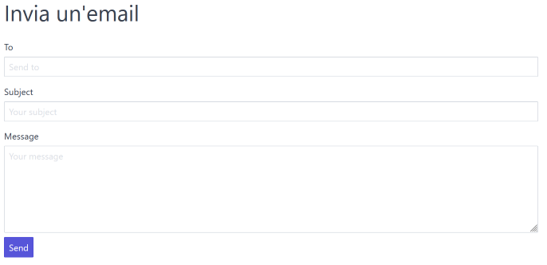

# Invio di una mail con PHP

Inserire all'interno del file `composer.json`
la dipendenza con **PHPMailer**

```json
{
  "require" : {
    "phpmailer/phpmailer": "^6.8"
  }
}
```
e procedere all'aggiornamento con `composer`.

## Esempio di utilizzo come script

Un esempio semplice di utilizzo si trova in nel file *example.php*,
che può essere eseguito a linea di comando.

Per utilizzare Gmail come provider di posta, vedere come impostare l'account 
usando le istruzioni presenti al link qua sotto.

[Link a StackOverflow (aggiornato al 06-05-2023)](https://stackoverflow.com/a/76186581)

## Esempio come pagina HTML per l'invio

Nel file `index.php` si trova invece un esempio che presenta una form per
l'invio di mail indicando il destinatario, il soggetto e il messaggio, utilizzando
`sendmail.tpl` come template e la classe `Email` che incapsula al suo interno
le funzionalità della classe `PHPMailer`.



## Nota
Abusare di un servizio di mail, può portare a identificare il mittente come 
*spammer* o ad altre limitazioni, o anche alla chiusura dell'account.
Questi esempi quindi vanno usati nella maniera corretta.

