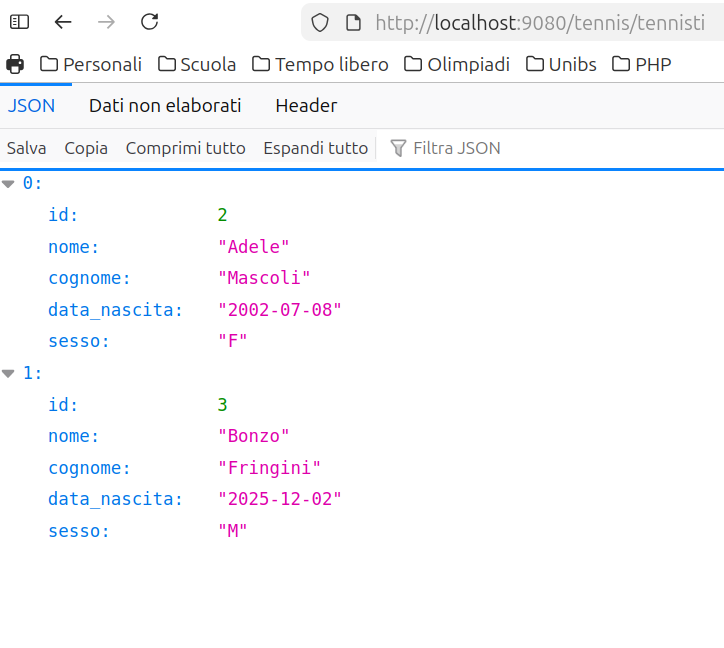

# Istruzioni per la creazione di un progetto con DB

1. Far partire Docker nell'unica cartella testata che si sa che funziona
2. Aprire un nuovo progetto PHPStorm nella cartella dove ci sono i progetti, non dove ci sono i file di Docker
3. Connettersi al DB tramite PHPStorm, che ha integrate le stesse funzionalità di DataGrip, utilizzando l'icona DB nella barra di destra. 
   1. Scegliere come Data Source -> MariaDB
   2. Impostare i parametri nella finestra di dialogo, scaricando i driver se servono
   3. Utilizzare l'utente corretto, root se si vogliono ad esempio creare nuovi database
   4. Testare la connessione e salvare con OK
4. Se serve, creare un database con l'istruzione
    ```sql
    CREATE DATABASE nome_db;
    ```
    tramite la console che si apre nell'editor
5. Impostare la console al database che si intende utilizzare tramite il menù a tendina in alto a destra.
6. Dare le istruzioni che consentono di creare le tabelle ed eventualmente popolarle, oppure importare il DB di interesse.
7. Ha senso esportare il database per tenerne una copia versionabile. Per collegarsi con il database in esecuzione nel container Docker, come prima cosa si verifica se la connessione è attiva, lanciando il seguente comando da console
   ```bash
    docker exec -it lamp_db mysql -u root -p
    ```
   Se tutto ha funzionato correttamente, si può procedere con l'esportazione, utilizzando il comando
   ```bash
   docker exec lamp_db mysqldump -u root -prootpassword tennis > tennis-2025-12-01.sql
    ```
   Se tutto è andato bene, nella cartella del progetto dovrebbe esserci un file chiamato `tennis-2025-12-01.sql`
   
8. A questo punto creiamo un file `index.php`, all'interno del quale si inseriscano le solite istruzione per utilizzare Slim. Prima di procedere con la scrittura delle operazioni sul database, si crei un file di configurazione.
9. Creare una cartella `conf` all'interno del progetto. Al suo interno creare un file `config.php`
10. Rispetto alla versione iniziale, il contenuto del file `index.php` deve contenere le istruzioni per connettersi al database tramite la libreria PDO (guardare il file `index.php` in questa cartella per vedere come è fatto)
11. A questo punto è necessario fare il *deployment* per testare il funzionamento dell'applicazione. Supponendo di avere già la cartella `vendor` nella root del server Web, è sufficiente fare il `deployment` dei file `index.php`, `.htaccess` e `conf/config.php`.
12. Infine, per controllare che tutto funzioni, è sufficiente connettersi con il proprio browser all'indirizzo `http://localhost:9080/tennis/tennisti`, e dovrebbe apparire qualcosa come questo


   